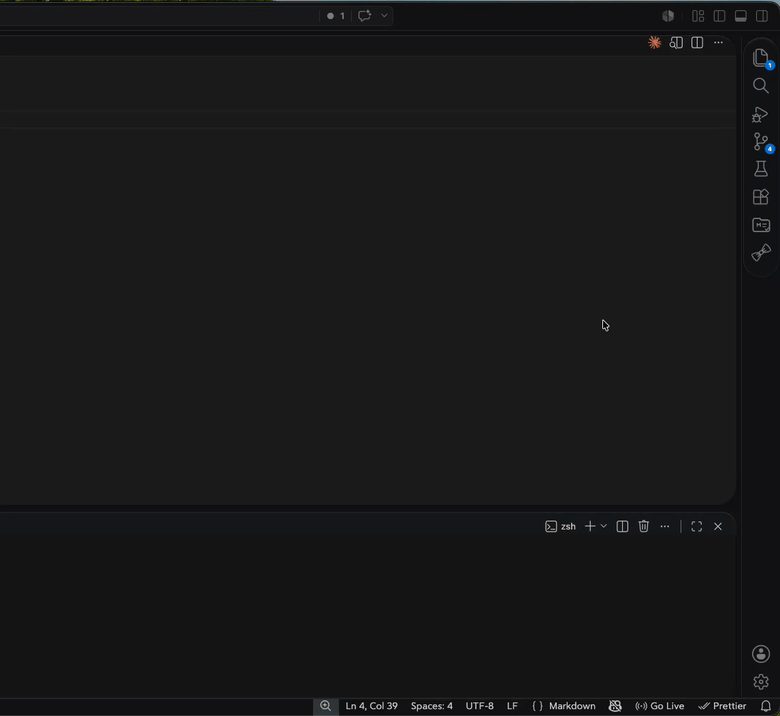

# Workspace Todo

A VS Code extension that provides a workspace-scoped todo list with markdown support, cloud sync, and an Activity Bar panel.

## Features

- **Workspace-scoped** — todos are saved per workspace and persist across sessions
- **Markdown support** — todo content is rendered as markdown (bold, italic, code, links, etc.)
- **Inline editing** — click any todo to edit it in place
- **Drag-and-drop reordering** — drag todos to rearrange them
- **Search** — filter todos in real time by text
- **Hide completed** — toggle visibility of completed todos
- **Clear completed** — remove all completed todos at once
- **Cloud sync** — sign in with Google to sync todos across all your machines

## Usage

1. Click the **Workspace Todo** icon in the Activity Bar to open the panel.
2. Type a todo in the input at the bottom and press **Enter** to add it.
3. Click the checkbox to mark a todo as complete.
4. Click the todo text to edit it inline.
5. Use the search bar to filter todos by content.
6. Use the toolbar menu (⋮) to hide completed todos or clear them all.

### Cloud Sync

1. Run **Workspace Todo: Sign In** from the Command Palette to authenticate with Google.
2. Link the current workspace to a synced workspace (or create a new one).
3. Todos push automatically on change and pull when you open the workspace.
4. Run **Workspace Todo: Sync Now** to force a manual sync at any time.
5. Run **Workspace Todo: Sign Out** to unlink your account.

## Keyboard Shortcuts

These shortcuts work in both the **add** input and the **edit** textarea. Select text first to format a selection, or press the shortcut with no selection to insert markers with the cursor placed between them.

| Shortcut | Mac | Effect |
| -------- | --- | ------ |
| `Ctrl+B` | `⌘B` | **Bold** — wraps with `**...**` |
| `Ctrl+I` | `⌘I` | *Italic* — wraps with `*...*` |
| `Ctrl+U` | `⌘U` | Underline — wraps with `<u>...</u>` |
| `Alt+↵` | `⌘↵` | Submit / save the todo |
| `Escape` | `Escape` | Cancel editing |

## Commands

| Command                                 | Description                                  |
| --------------------------------------- | -------------------------------------------- |
| `Workspace Todo: Clear Completed Todos` | Removes all completed todos                  |
| `Workspace Todo: Sign In`               | Sign in with Google to enable cloud sync     |
| `Workspace Todo: Sign Out`              | Sign out and unlink cloud sync               |
| `Workspace Todo: Sync Now`              | Force a manual sync with the cloud           |

## Settings

| Setting                          | Default                      | Description                                   |
| -------------------------------- | ---------------------------- | --------------------------------------------- |
| `workspace-todo.hideCompleted`   | `false`                      | Hide completed todos from the list            |
| `workspace-todo.apiBaseUrl`      | `https://vs-todo.quans.pro`  | Backend API URL used for cloud sync           |

## Tech Stack

- **TypeScript** — extension host and webview
- **React** — webview UI
- **esbuild** — bundler for both extension and webview
- **marked** — markdown rendering
- **SortableJS** — drag-and-drop reordering

## Links

- [VS Code Marketplace](https://marketplace.visualstudio.com/items?itemName=quan-vo.vs-workspace-todo)
- [Website](https://vs-todo.quans.pro)
- [GitHub](https://github.com/minhquankq/vs-workspace-todo)

## License

[MIT](LICENSE)
